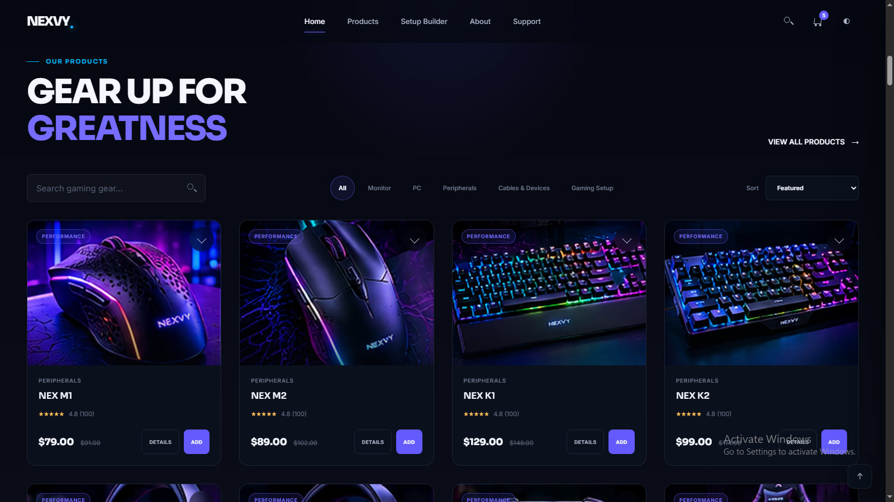

# NEXVY Gaming E-commerce Landing page 

A modern and fully responsive gaming e-commerce frontend built with HTML5, Modern CSS3, and JavaScript.

NEXVY Gaming is a frontend project focused on creating a realistic gaming store experience with modern UI design, responsive layouts,

## Live Demo

[View Naxvy Gaming](https://naxvy-gaming.netlify.app/)

## 📸 Screenshots

### Home Page


### Products



### Setup Builder


### Responsive


## Features

- Fully Responsive premium landing page
- Sticky glassmorphism header
- Product search and filtering
- Category sorting
- Cart drawer interactions
- Product quick view modal
- Theme toggle
- Setup builder concept
- Testimonials and FAQ sections
- Newsletter form validation

## Tech Stack 

- HTML5
- Modern CSS3
- JavaScript (ES6+)

## Run Locally

Serve the project with a local static server, then visit `http://localhost:8000`.

```bash
python -m http.server 8000
```

## Project Structure

```text
Nexvy Gaming/
│
├── index.html
│
├── CSS/
│   ├── variables.css
│   ├── style.css
│   └── responsive.css
│
├── JS/
│   ├── storage.js
│   ├── data.js
│   ├── products.js
│   ├── cart.js
│   ├── search.js
│   ├── wishlist.js
│   ├── setup-builder.js
│   └── main.js
│
├── assets/
│   └── screenshots/
│
├── README.md
│
└── .gitignore
```

## Notes

This project was built to strengthen my skills in frontend development, responsive design, UI/UX, and JavaScript while creating a realistic gaming e-commerce experience.

NEXVY Gaming is a frontend portfolio project and does not process real orders or payments.

## Author

- GitHub: [@syedfurqanullah](https://github.com/syedfurqanullah)
- LinkedIn: [Syed Furqan Ullah](https://www.linkedin.com/in/syed-furqan-ullah/)
